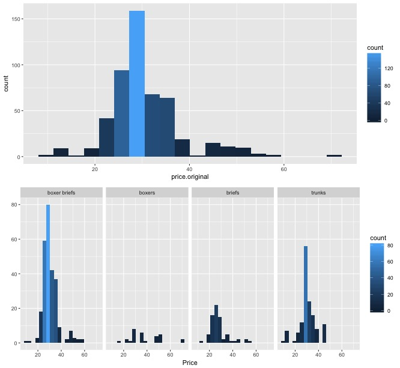
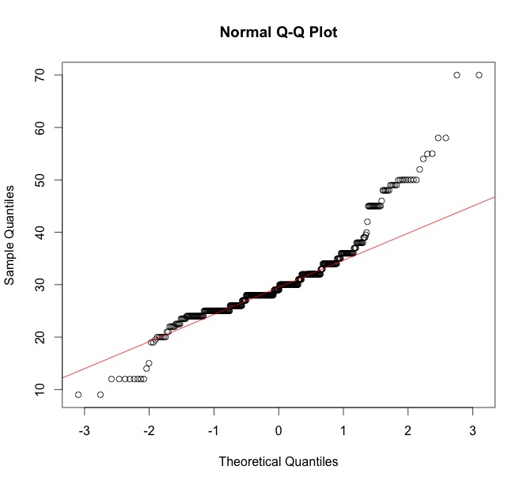
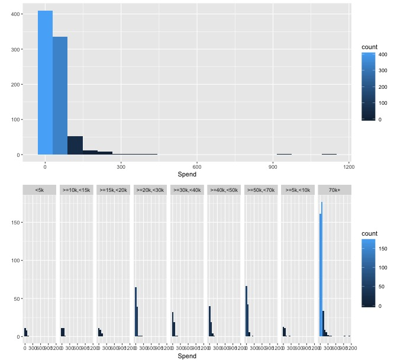
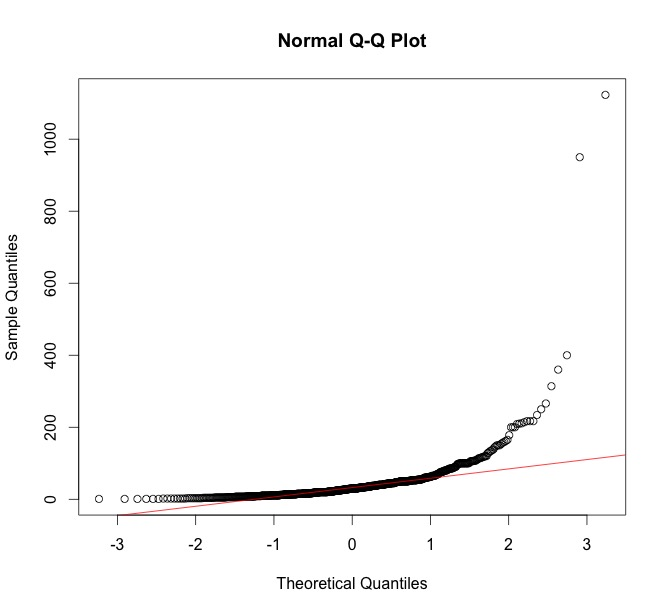
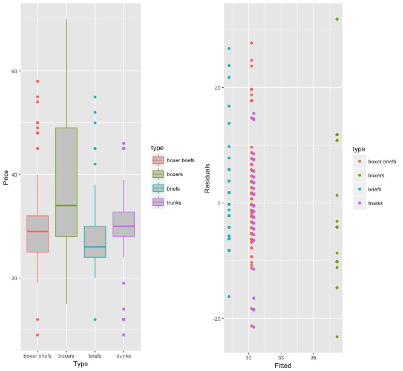
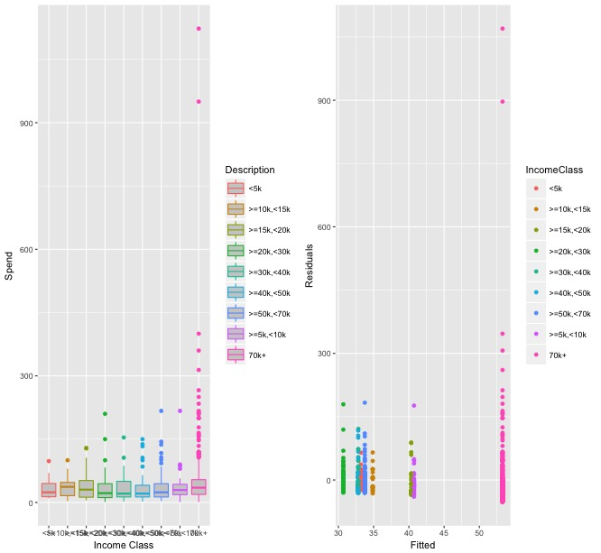

TeamUndies: Market Analysis Using Free Resources
========================================================
author: Cesar Espitia, Ilya Kats and Michael Muller
date: May 18, 2017
autosize: true

Contents
========================================================

Problem  
Methodology and Data Collection  
Validation  
Analysis  
Conclusion
Lessons Learned  

Problem
========================================================

A new underwear brand is being launched that caters to the larger stylish gentlemen.  

No market analysis has been done to determine what to offer besides a boxer brief and at what price.

Using resources like Ibisworld or Gartner are cost prohibitive as reports and dossies can cost in the thousands.  

The goal of this project is to find freely available data to create a market analysis that will help them in making their decisions. 

Methodology and Data Collection
========================================================

The data was collected by using information found on retailers websites.  Those chosen were:
- Bloomingdales
- Nordstrom
- CK
- Bureau of Labor Statistics

Other websites were considered but each site was unique and required additional time.

Methodology and Data Collection
========================================================

Webscraping

Validation (Retail Sites)
========================================================

A total of 511 rows of data were collected from Bloomingdales, Nordstrom and CK.  In ensuring the validity of the data, histograms for the price of the overall dataset, price by underwear type, and a normal QQ plot were chosen.  

The data is normally distributed.  

Validation (BLS)
========================================================

A total of 825 rows of data were collected from the Bureau of Labor Statistics on personal consumption behavior for a quarter in 2015 for all genders.  In ensuring the validity of the data, a normal QQ plot were chosen.  

The data is heavily right skewed.  

Analysis (Retail)
========================================================

Since pricing is the key goal and what other underwear type to offer, the choice become apparent that an ANOVA analysis would be more appropriate acorss the garment types.  

Ho: There is no difference in pricing by underwear type.   
Ha: There is a difference in pricing by underwear type.

The results of the analysis show that there is a differece since the probability is <b>Pr(>F) = 2.8e-8.</b>

Analysis (BLS)
========================================================

Separately, in providing a more rounded analysis, what demographic to target in a potential marketing campaign was also analyzed.  An ANOVA analysis was also used to determine if there is a difference between the income classes. 

Ho: There is no difference in spend between income classes.  
Ha: There is a difference in spend between income classes.

The results of the analysis show that there is a difference since the probability is <b>Pr(>F) = 0.01</b>

From our validation, this data is heavily right skewed which may invalidate this statistical test.  However, as a guiding factor for the company in terms of who to target, the information is valid for descriptive purposes.  

Conclusion
========================================================

The data collected will provide strong guidance to the fledging brand to determine what direction they should take.

They should consider <b>trunks</b> as the secondary type based upon prevalency in the retail space at an approximate <b>price point of $25-$35 a pair</b>.

They should also consider a marketing campaign based upon income as a factor.  In reviewing the data those that made more than $50,000 tended to have a higher purchase amount in the public data.  

Appendix A
========================================================

