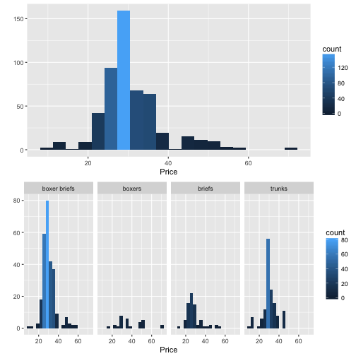

TeamUndies: Market Analysis Using Free Resources
========================================================
author: Cesar Espitia, Ilya Kats and Michael Muller
date: May 18, 2017
autosize: true

Contents
========================================================

Problem  
Methodology  
Data Collection  
Analysis  
Results  
Lessons Learned  

Problem
========================================================

Indeed was the source of our job postings for this analysis as it’s currently one of the most used job search engine.  

Vast number of skills led our team to aggregate skills into key groups.  

Major US Cities with known tech structures chosen as well as countries that are high tech for 2016 and 2017.  

Methodology
========================================================

T

Data Collection
========================================================

Indeed was the source of our job postings for this analysis as it’s currently one of the most used job search engine.  

Vast number of skills led our team to aggregate skills into key groups.  

Prior to running an analysis, the data had to be validated for full use.  In looking at all the data, we noticed that each category wasn't sufficiently being reprsented.  

Boxers only had 11 samples in over 200.  Any analysis on this small of a sample may not be statistically valid and therefore this category was segmented out accordingly leaving only boxer brifes, briefs and trunks.  

Analysis
========================================================

Indeed was the source of our job postings for this analysis as it’s currently one of the most used job search engine.  

Vast number of skills led our team to aggregate skills into key groups.  

Major US Cities with known tech structures chosen as well as countries that are high tech for 2016 and 2017.  

Results
========================================================

Indeed was the source of our job postings for this analysis as it’s currently one of the most used job search engine.  

Vast number of skills led our team to aggregate skills into key groups.  

Major US Cities with known tech structures chosen as well as countries that are high tech for 2016 and 2017.  

Lessons Learned
========================================================

Indeed was the source of our job postings for this analysis as it’s currently one of the most used job search engine.  

Vast number of skills led our team to aggregate skills into key groups.  

Major US Cities with known tech structures chosen as well as countries that are high tech for 2016 and 2017.  

Appendix A
========================================================

 
