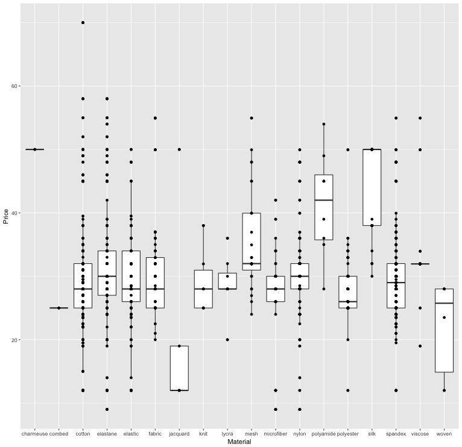
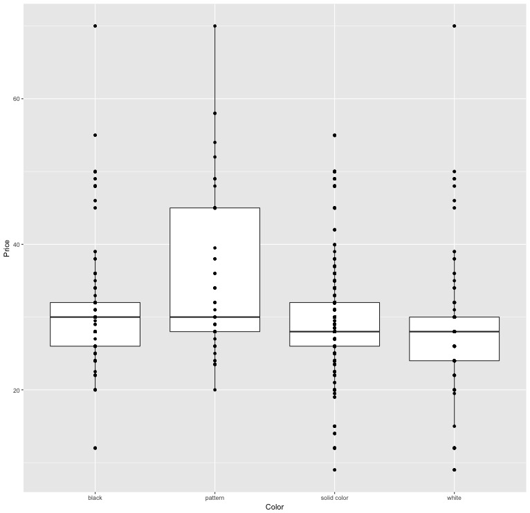
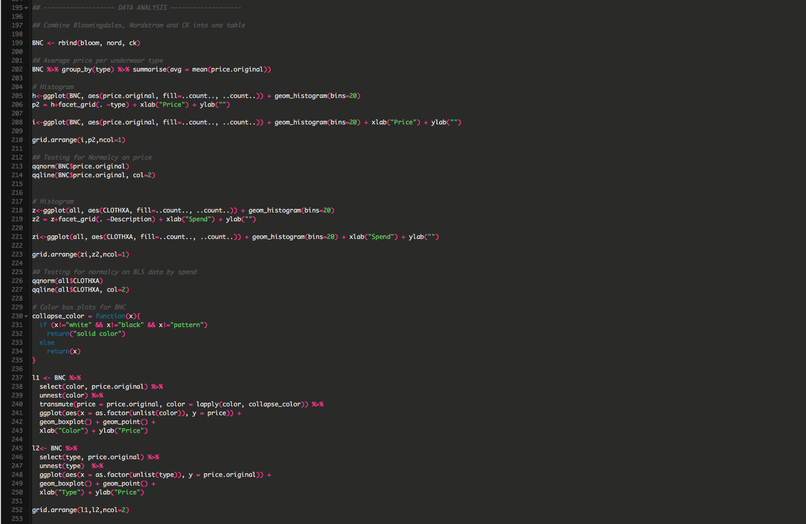
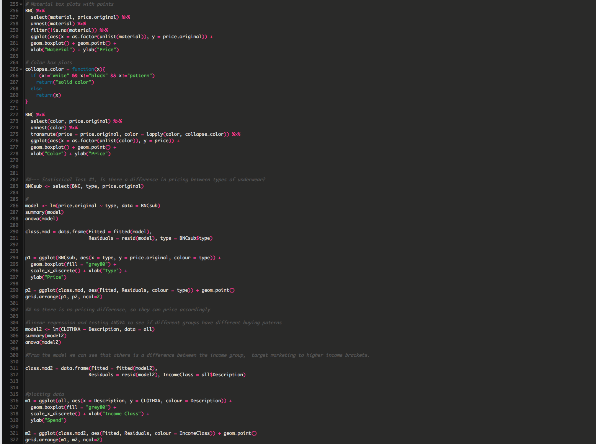

TeamUndies: Market Analysis Using Free Resources
========================================================
author: Cesar Espitia, Ilya Kats and Michael Muller
date: May 18, 2017
autosize: true

Contents
========================================================

Problem  
Methodology and Data Collection  
Validation  
Analysis  
Conclusion

Problem
========================================================

A new underwear brand is being launched that caters to the larger, more stylish gentlemen.  

A boxer brief has been developed by the founders but they also need to offer one more type and need to know how to price it.  

This information is provided by resources like Mintel, Ibisworld or Gartner but are cost prohibitive (single analysis upwards of $1,000 at times)

The goal of this project is to find <b>freely available</b> data to create a market analysis that will help them in answering the question:  

<b><i>What other underwear type do I develop and how do I price it?</i></b>

Methodology and Data Collection
========================================================

The data was collected by using information found on retailers websites.  Those chosen were:
- Bloomingdales (www.bloomingdales.com)
- Nordstrom (www.nordstrom.com)
- Calvin Klein (www.calvinklein.com)

Data was collected from retailers in the first week of May 2017. Other websites were originally considered but the three above provided a good sample for analysis.  

To further round out the data collection, data from a government source was used to determine household spend on particular goods.  

The Bureau of Labor Statistics (BLS) had a consumer expenditure diary data. The data downloaded was from Quarter 1 in 2015 only for category 200 (Undergarments) (source: https://www.bls.gov/cex/).  

Methodology and Data Collection
========================================================

Webscraping

Validation (Retail Sites)
========================================================

A total of 511 rows of data were collected from Bloomingdales, Nordstrom and CK.  

To determine the validity of the data, a histogram of price, a histogram of price by underwear type, and a normal QQ plot are shown below.  

The overall price histogram looks normally distributed and the QQ plot to show little to no abnormalities.  

Validation (BLS)
========================================================

A total of 825 rows of consumer purchasing data were collected from the Bureau of Labor Statistics on undergarment spend for the first quarter in 2015 for all genders.  

To determine the validity of the data, a histogram of overall spend, a histogram of overall spend by income class, and a normal QQ plot are shown below.  

The data is heavily right skewed.  Although not normally distributed, the data will be included for analyiss to provide guidance.  

Analysis (Retail)
========================================================

Since the goal is to determine a secondary underwear type to develop and the price point, the choice become apparent that an ANOVA analysis would be more appropriate acorss the undergarment types.  

Ho: There is no difference in pricing by underwear type.   
Ha: There is a difference in pricing by underwear type.

The results of the analysis show that there is a differece since the probability is <b>Pr(>F) = 2.8e-8.</b>

Analysis (BLS)
========================================================

Separately, an analysis was done on potential customers to target in a potential marketing campaign was also provided.  An ANOVA analysis was also used to determine if there is a difference between the income classes. 

Ho: There is no difference in spend between income classes.  
Ha: There is a difference in spend between income classes.

The results of the analysis show that there is a difference since the probability is <b>Pr(>F) = 0.01</b>

From our validation, this data is heavily right skewed which may invalidate this statistical test.  

The information is valid, however, for descriptive purposes as a guiding factor for the company in terms of who to target.

Conclusion
========================================================

The data collected will provide strong guidance to the startup brand to determine what direction they should take.

- They should consider <b>trunks</b> as the secondary type based upon prevalency in the retail space at an approximate <b>price point of $25-$35 a pair</b>.

- They should also consider a marketing campaign based upon income as a factor.  

- Those with a household income of greater than $50,000 tended to have a higher spend in the undergarment category.  

Appendix A
========================================================

Additional Plots for Retailer Data.  

Material vs. Price and Color vs Price. 

Appendix B (Code Part 1)
========================================================

Appendix B (Code Part 2)
========================================================

Appendix B (Code Part 3)
========================================================

